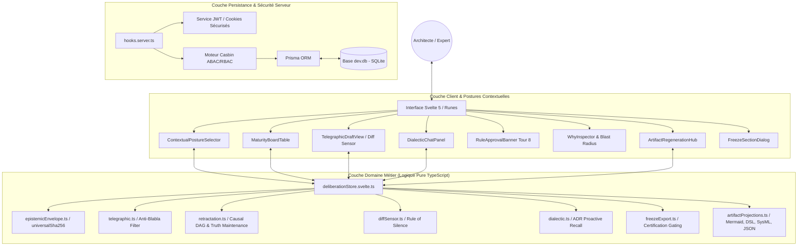
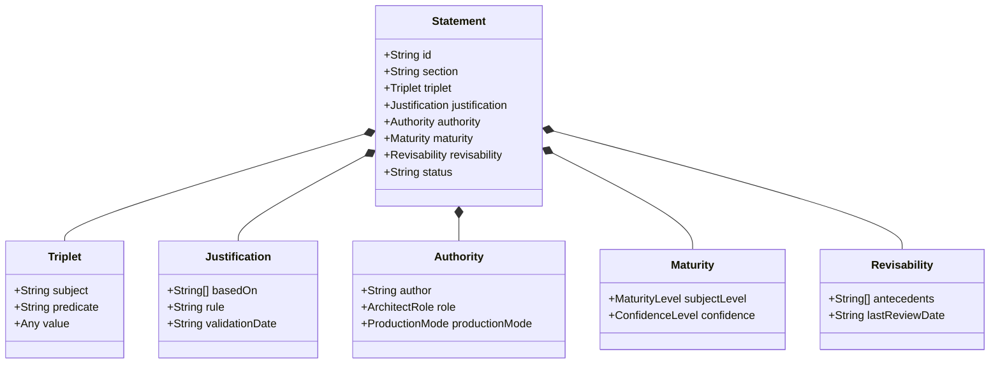
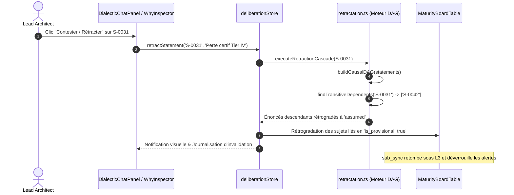
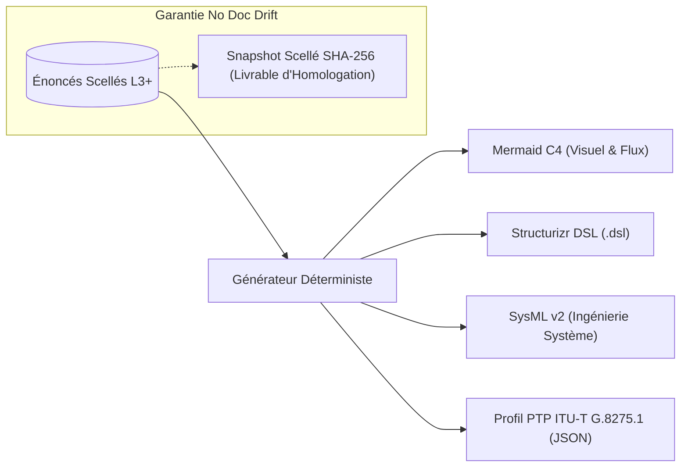

# Archinex · Software Architecture Documentation

> **Document d'Architecture Système du Workbench de Délibération Archinex.**
> Conforme aux standards de modélisation système et aux spécifications *SmartMemory × LLMOps*.

---

## 1. Vue Globale du Système

Archinex repose sur une architecture bicéphale intégrée sous **SvelteKit 2** :
1. **Socle d'Administration & Sécurité** : Authentification JWT, contrôle d'accès basé sur les attributs (Casbin ABAC/RBAC) et persistance Prisma ORM sur SQLite (`better-sqlite3`).
2. **Workbench de Délibération Architecturale** : Moteur de vérité logique, gestion des controverses épistémiques, brouillons-appâts télégraphiques, rappels de doctrine proactifs et projections déterministes vers les outils système tiers.

---

## 2. Le Modèle Épistémique à 5 Facettes

Pour éviter l'illusion de consensus et l'hallucination d'accords par l'IA, tout énoncé d'architecture manipulé par Archinex est encapsulé dans un contrat strict à 5 facettes :

### Invariant Inviolable : Règle Bloquante `verified × llm-derived`
Aucun énoncé ne peut être promu au statut de confiance `verified` s'il est produit en mode `llm-derived`. La vérification requiert formellement l'intervention humaine d'un architecte qualifié (`human-authored` ou `llm-proposed-human-approved`). Tout manquement est rejeté dès la couche de validation du schéma (`epistemicEnvelope.ts`).

### Hachage FIPS 180-2 Client / Serveur Isomorphe
Afin d'éviter tout écueil d'incompatibilité entre l'environnement Node.js (`crypto.createHash`) et le bundle navigateur Vite, le calcul des empreintes d'intégrité repose sur une implémentation pure TypeScript de **SHA-256** (`universalSha256`), garantissant une stricte parité d'empreinte sur l'ensemble des couches.

---

## 3. Le Moteur de Rétractation Causale (Truth Maintenance System)

Lorsqu'une hypothèse est contestée ou invalidée par un architecte (par exemple lors de la remise en cause d'un oscillateur Rubidium sur `S-0031`), le système ne supprime pas l'historique : il propage l'invalidation le long du graphe acyclique direct (DAG) des dépendances.

---

## 4. Capteur par le Diff & Règle Stricte du Silence

- **Édition textuelle en place** : L'architecte modifie directement les brouillons télégraphiques. Le composant `diffSensor.ts` calcule la différence (`oldValue` vs `newValue`) et génère immédiatement un énoncé auditable sans exiger de formulaire verbeux.
- **Règle du Silence** : Une hypothèse non contestée n'est **jamais** considérée comme acceptée. L'approbation doit résulter d'un acte formel d'arbitrage.

---

## 5. Gel de Section & Projections Déterministes Sans Dérive (No Doc Drift)

Archinex ne stocke pas de représentations graphiques statiques. Tout artefact système est une **projection déterministe** générée à la volée à partir des énoncés scellés :

### Critères de la Barrière de Certification (Gating)
1. **Maturité** : Section $\ge$ `L3_decided`.
2. **Conflits** : 0 conflit d'architecture ouvert.
3. **Hypothèses** : 0 énoncé `assumed` actif.
4. **Habilitation** : Rôle `Lead Architect` requis.

---

## 6. Pipeline de Validation et d'Assurance Qualité

Le système est validé par une pyramide de tests contractuels et d'intégration :
- `epistemic-statement.test.ts` : Rejet des énoncés invalides et interdiction `verified × llm-derived`.
- `telegraphic-draft.test.ts` : Rendu strict et filtre anti-blabla.
- `maturity-board.test.ts` : Ordonnancement par déblocages et détection de stagnation.
- `diff-sensor.test.ts` : Capture de rectifications et règle du silence.
- `dialectic-recall.test.ts` : Moteur de rappel proactif d'ADRs.
- `retractation-engine.test.ts` : Propagation de clôture logique sur DAG causal.
- `freeze-export.test.ts` : Scellement cryptographique et projections sans dérive.
- `deliberation-workflow.test.ts` : Scénario d'intégration bout-en-bout.
