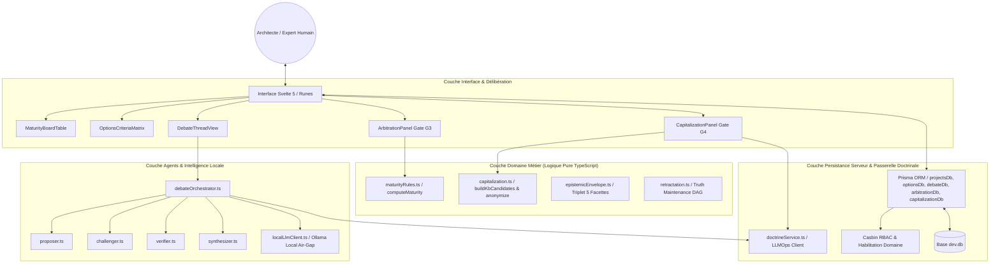
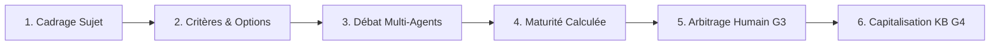
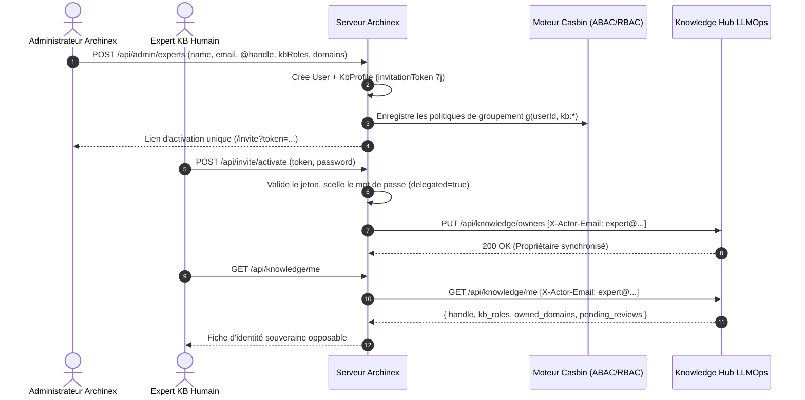

# Archinex · Software Architecture Documentation

> **Document d'Architecture Système du Moteur de Co-Conception et Délibération Archinex.**
> Conforme aux standards de modélisation système, à la constitution épistémique et aux spécifications *LLMOps × SmartMemory*.

---

## 1. Vue Globale du Système

Archinex est le **seul propriétaire de l'état des projets et du déroulé de co-conception**, orchestré selon une architecture SvelteKit 2 / Prisma :
1. **Socle d'Administration & Sécurité** : Authentification JWT, contrôle d'accès basé sur les attributs (Casbin ABAC/RBAC) et persistance relationnelle Prisma ORM (SQLite en développement, PostgreSQL en production).
2. **Moteur de Délibération Architecturale** : Chaîne de co-conception opposable en 6 étapes :
   - Extraction des sujets et cadrage télégraphique ;
   - Critères multi-facettes, options contrastées et compromis ;
   - Débat contradictoire multi-agents borné (Proposer, Challenger, Verifier, Synthesizer) ;
   - Évaluation automatisée de la maturité calculée (`computeMaturity`) ;
   - Arbitrage humain opposable (Porte G3, passage à `L3_decided`) ;
   - Capitalisation souveraine vers le Knowledge Hub LLMOps (Porte G4).

---

## 2. Le Modèle Épistémique et la Constitution

Tout énoncé, option, argument ou décision manipulé par Archinex obéit aux invariants de la Constitution (`openspec/constitution.md`) :

### Invariants Inviolables
1. **Énoncé à 5 facettes** : Contenu (triplet ontologique), Justification (antécédents), Autorité (auteur, rôle, mode de production), Maturité (niveau, confiance), Révisabilité.
2. **Règle Bloquante `verified × llm-derived`** : Aucun énoncé ni argument ne peut être promu au statut de confiance `verified` s'il est produit en mode `llm-derived`. La vérification et la décision requièrent formellement l'intervention humaine d'un architecte qualifié (`human-authored` ou `llm-proposed-human-approved`).
3. **Règle du Silence** : Une hypothèse, objection ou dilemme non contesté n'est **jamais** considéré comme approuvé tacitement. L'approbation doit résulter d'un acte formel d'arbitrage.
4. **Brouillon Télégraphique** : Style télégraphique dense, sans jargon creux ni verbiage IA non vérifié.

---

## 3. Le Cycle de Co-Conception en 6 Étapes

### Étape 1 : Cadrage du Sujet
Énonciation claire du `problemStatement` et référence de section. Le sujet démarre au niveau `L0_named` puis `L1_framed`.

### Étape 2 : Critères & Options Contrastées
Définition d'au moins 2 critères d'évaluation pondérés et formulation d'au moins 2 options d'architecture viables. Chaque option est notée (de -2 à +2) sur l'ensemble des critères avec justification obligatoire.

### Étape 3 : Débat Multi-Agents Borné
Un tour d'orchestration (3 tours maximum) enchaîne 4 agents spécialisés :
- **Proposer** : Défend les options et suggère des options complémentaires si nécessaire.
- **Challenger** : Émet au moins une objection argumentée par option (risques, coûts cachés, dépendances).
- **Verifier** : Contrôle la conformité avec la doctrine via `checkOption` et produit des arguments de vérification avec références KB strictes.
- **Synthesizer** : Résume les points de tension, les compromis et les questions clés pour l'arbitre humain.

Toute objection doit être résolue (`answered` ou `accepted_risk`) par un expert humain habilité avant l'arbitrage.

### Étape 4 : Calcul Dynamique de la Maturité (`computeMaturity`)
La maturité d'un sujet n'est plus fixée manuellement : elle est calculée par une fonction pure qui évalue 8 codes de blocage :
- `MISSING_PROBLEM_STATEMENT` : Problème non formulé.
- `MISSING_CRITERIA` : Moins de 2 critères définis.
- `INSUFFICIENT_OPTIONS` : Moins de 2 options formulées.
- `UNEVALUATED_OPTION` : Option non évaluée sur tous les critères.
- `OPEN_OBJECTION` : Objection ouverte non résolue dans le débat.
- `UNRESOLVED_VIOLATION` : Règle doctrinale violée sans dérogation justifiée.
- `OPEN_BLOCKING_QUESTION` : Question bloquante sans réponse.
- `COVERAGE_INCOMPLETE` : Référentiel réglementaire projet (`NIS2`, `SecNumCloud`...) non couvert.

### Étape 5 : Arbitrage Humain Opposable (Porte G3)
Seul un `lead_architect` ou un `domain_expert` habilité sur le domaine du sujet peut prononcer l'arbitrage :
- Sélection de l'option retenue ;
- Enregistrement des motifs d'écartement pour chaque alternative ;
- Évaluation de la réversibilité (`reversible`, `costly`, `irreversible`) ;
- Enregistrement des dérogations acceptées avec justification opposable ;
- Promotion formelle à `L3_decided` et transformation des énoncés dérivés en `llm-proposed-human-approved`.

### Étape 6 : Capitalisation Souveraine vers LLMOps (Porte G4)
Chaque arbitrage produit automatiquement des candidats à la Knowledge Base :
1. `new_asset` : Si l'option retenue constitue un nouveau pattern sans antécédent doctrinal.
2. `amendment` : Pour chaque dérogation acceptée, afin d'adapter la règle d'entreprise.
3. `rex` : Synthèse systématique du compromis architectural et des motifs du choix.

**Garanties Souveraines :**
- **Anonymisation stricte** : Nettoyage automatique des noms de projets, clients, sites, participants, adresses IP et volumes chiffrés.
- **Invariant III (Human-in-the-loop)** : L'architecte prévisualise et peut modifier chaque candidat avant envoi. Rien n'est expédié sans action humaine explicite.
- **Suivi des statuts** : Synchronisation avec la file LLMOps (`in_review`, `accepted`, `rejected`).

---

## 4. Pipeline de Validation et d'Assurance Qualité

La qualité et l'étanchéité du système sont garanties par le script unifié `node scripts/verify.mjs` validant 4 portes d'acceptation :
1. **Denylist Check** : 0 terme projet ou fournisseur interdit dans `src/`.
2. **Vitest Test Suites** : 201 tests unitaires, contractuels et d'intégration validés.
3. **Svelte Check** : 0 erreur, 0 avertissement de typage strict TypeScript / Svelte 5.
4. **Production Build** : Compilation complète des bundles client et serveur SSR.

---

## 5. Gouvernance Knowledge Hub & Comptes Experts (Lot A6)

Archinex gère les comptes utilisateurs locaux et assure la propagation stricte de l'identité des experts vers LLMOps, qui demeure l'autorité sur le registre des propriétaires (`owners`) et la recevabilité doctrinale.

### Rôles KB Canoniques
- `kb:review` : Droit de voter, d'approuver ou de rejeter les candidats de doctrine et amendements.
- `kb:evaluate` : Droit d'exécuter et d'annoter les bancs d'évaluation et suites de tests.
- `kb:maintain` : Droit de modifier et de mettre à jour directement les règles de doctrine et templates de prompt.
- `kb:admin` : Droit de superviser les propriétaires, publier des releases doctrinales et administrer la gouvernance.

### Propagation d'Identité Souveraine (`X-Actor-Email`)
Tout appel expert émis vers LLMOps (`/api/knowledge/me`, `/api/knowledge/owners`, `/api/knowledge/candidates`...) propage l'entête HTTP `X-Actor-Email: <user_email>`. Aucun secret de service (`LLMOPS_AUTH_TOKEN`) n'est jamais exposé au navigateur client.

