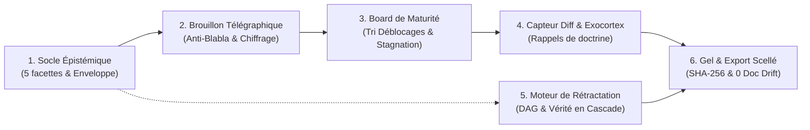

# Archinex · Deliberation Workbench

> **Plateforme d'arbitrage, de convergence dialectique et de gouvernance d'architecture adossée au Knowledge Hub LLMOps.**

Archinex outille le *modèle de délibération* entre architectes experts et agents IA. Plutôt que de concurrencer les outils de modélisation système (Structurizr, SysML v2, Enterprise Architect, Mermaid), Archinex capture les controverses, maintient la cohérence de vérité logique par graphe causal, chasse le blabla par des brouillons-appâts percutants et projette de façon déterministe les énoncés prouvés vers les outils cibles sans dérive documentaire.

---

## 🎯 Les 6 Piliers & Invariants Fondamentaux



### 1. Socle Épistémique à 5 Facettes & Enveloppe Scellée
- Tout énoncé d'architecture est qualifié selon 5 dimensions opposables :
  1. **Triplet formel** : Sujet, Prédicat, Valeur.
  2. **Justification** : Références causales directes (`basedOn`).
  3. **Autorité & Mode** : Auteur, rôle, et mode de production (`human-authored`, `llm-proposed-human-approved`, `llm-derived`).
  4. **Maturité** : Niveau de section (`L0_named` à `L5_archived`) et confiance (`verified`, `designed`, `assumed`, `contested`).
  5. **Révisabilité** : Antécédents conditionnant la validité logique de l'énoncé.
- **Règle bloquante inviolable** : Interdiction absolue de la combinaison `verified × llm-derived` (la vérification requiert toujours une validation humaine).

### 2. Brouillon-Appât Télégraphique (Anti-Blabla)
- Syntaxe stricte et percutante : `retenu`, `supposé`, `conflit`, `manque`, `variante B`.
- **Règle Anti-Blabla** : Rejet automatique de toute phrase passive, verbeuse (> 15 mots) ou complaisante (« il est recommandé »).
- **Chiffrage et conséquences matérielles** : Surcoûts CAPEX/OPEX mis en évidence en rouge (`+180 k€`) pour forcer l'arbitrage.

### 3. Board de Maturité Trié par Effet Multiplicateur (`unlocks_count`)
- Tri dynamique priorisant les sections débloquant le plus de dépendants en aval.
- Pastille visuelle d'alerte pour les sections en **stagnation (> 14 jours sans transition)**.
- File des questions ouvertes et relance des experts en 1 clic.

### 4. Capteur par le Diff, Règle du Silence & Rappel de Doctrine
- **Édition en place** : Toute modification textuelle de l'architecte génère un énoncé auditable `human-authored`.
- **Règle stricte du silence** : L'absence de réaction ou de contestation ne vaut jamais approbation.
- **Rappels proactifs de doctrine** : Émergence en temps réel des ADRs pertinents dès qu'un sujet tranché est évoqué.
- **Capitalisation (Porte G4)** : Chaque décision arbitrée produit des candidats anonymisés pour la base de connaissances LLMOps. Rien n'est transmis sans validation humaine explicite, et l'acceptation reste réservée aux experts du domaine.

### 5. Moteur de Rétractation Causale (Truth Maintenance System)
- Modélisation du graphe acyclique direct (DAG) des dépendances `basedOn`.
- **Invalidation logique en cascade** : La contestation d'un antécédent (ex: `S-0031`) rétrograde automatiquement tous ses descendants (ex: `S-0042`) au statut `assumed`.
- Rétrogradation automatique de la maturité des sujets concernés et réactivation du statut `provisoire`.

### 6. Barrière d'Homologation, Gel SHA-256 & Projections Déterministes (No Doc Drift)
- **Barrière de certification** : Interdiction formelle de geler une section si elle est sous L3, contient des conflits ouverts ou des hypothèses `assumed`.
- **Condensat d'homologation SHA-256** scellant l'ensemble du livrable et ses références externes immuables (`KH:AssetId@vVersion`).
- **Hub de régénération multi-système déterministe** :
  - Diagrammes d'architecture **Mermaid**.
  - Modèles de conteneurs **Structurizr DSL** (`.dsl`).
  - Définitions d'ingénierie système **SysML v2**.
  - Profils de configuration réseau **PTP ITU-T G.8275.1 (JSON)**.

---

## 🧭 Les 3 Postures Contextuelles Non-Linéaires

Chaque architecte évolue à son rythme sur chaque section sans bloquer le reste de l'équipe :

1. **Posture 1 : Appropriation & Cadrage Pédagogique** : Acculturation aux normes et synthèses des standards CCTP (3GPP Release 17 / TS 38.300, Directive NIS2 / Doctrine ANSSI, Tier Standards).
2. **Posture 2 : Délibération & Cristallisation** : Cœur dialectique, confrontation d'hypothèses, arbitrage des variantes divergentes et détection des diffs.
3. **Posture 3 : Rendu & Homologation** : Scellement cryptographique SHA-256 et projection instantanée vers les outils de modélisation système.

---

## 🛠️ Stack Technique

- **Framework Web** : [SvelteKit 2](https://kit.svelte.dev/) avec Svelte 5 (100% Runes : `$state`, `$derived`, `$props`).
- **Styles & Design** : [Tailwind CSS v4](https://tailwindcss.com/) avec `@tailwindcss/vite` et [Lucide Svelte](https://lucide.dev/).
- **Base de Données & Auth** : Node.js, [Prisma ORM](https://www.prisma.io/) (SQLite via `better-sqlite3`), Casbin (ABAC/RBAC) et JWT sécurisés.
- **Tests & Assurance Qualité** : [Vitest](https://vitest.dev/) (tests de contrat et scénarios d'intégration bout-en-bout).
- **Déploiement** : Dockerfile multi-stage durci, compatible **GCP Cloud Run** via `@sveltejs/adapter-node`.

---

## 🚀 Démarrage Rapide

### Prérequis
- Node.js $\ge$ 20.x
- npm $\ge$ 10.x

### Installation
```bash
# 1. Cloner le dépôt et installer les dépendances
git clone https://github.com/votre-orga/archinex.git
cd archinex
npm install

# 2. Configurer les variables d'environnement
cp .env.example .env

# 3. Initialiser la base SQLite de développement
npx prisma db push
npx prisma db seed

# 4. Lancer le serveur de développement
npm run dev
```

Rendez-vous sur [http://localhost:5173/deliberation](http://localhost:5173/deliberation) pour accéder au Workbench de Délibération.

---

## 🧪 Tests & Vérification Qualité

Le projet maintient une politique stricte de zéro régression et zéro avertissement :

```bash
# Lancer l'intégralité de la suite de tests Vitest (les tests « live » contre un LLMOps réel sont ignorés sans `LLMOPS_LIVE_URL`)
npm run test

# Vérifier le typage strict TypeScript et les Runes Svelte 5 (0 erreur, 0 avertissement)
npm run check

# Compiler l'application pour la production avec l'adaptateur Node
npm run build

# Commande tout-en-un : tests + check + build
npm run verify
```

---

## 📂 Organisation du Projet

```
archinex/
├── .arckit/                        # Référentiel de gouvernance d'architecture d'entreprise
│   ├── references/                 # Checklists de qualité, conventions d'identification
│   └── templates/                  # Modèles d'artefacts (ADR, REQ, SOBC, Wardley)
├── openspec/                       # Spécifications exécutables et propositions d'évolution
│   └── changes/
│       └── archinex-deliberation-workbench/ # Carnet de spécification & tâches (Lots 1 à 6)
├── src/
│   ├── lib/
│   │   ├── components/deliberation/ # Composants Svelte 5 du Workbench
│   │   │   ├── ContextualPostureSelector.svelte # Sélecteur des 3 postures
│   │   │   ├── MaturityBoardTable.svelte        # Table 6 cols triée par déblocages
│   │   │   ├── TelegraphicDraftView.svelte      # Brouillon-appât & Diff sensor
│   │   │   ├── DialecticChatPanel.svelte        # Chat multi-canal & rappels ADR
│   │   │   ├── PedagogicalFramingPanel.svelte   # Cadrage Posture 1 (3GPP, NIS2)
│   │   │   ├── WhyInspector.svelte              # Inspecteur 5 facettes & DAG
│   │   │   ├── FreezeSectionDialog.svelte       # Scellement SHA-256 de section
│   │   │   └── ArtifactRegenerationHub.svelte   # Projections déterministes (No Doc Drift)
│   │   ├── domain/                  # Logique métier pure (indépendante de la vue)
│   │   │   ├── epistemicEnvelope.ts # Validation des enveloppes & universalSha256
│   │   │   ├── telegraphic.ts       # Rendu télégraphique & filtre anti-blabla
│   │   │   ├── maturityBoard.ts     # Tri par déblocages & calcul de stagnation
│   │   │   ├── diffSensor.ts        # Détection de diffs & règle du silence
│   │   │   ├── dialectic.ts         # Moteur de rappel proactif de doctrines
│   │   │   ├── retractation.ts      # DAG causal & invalidation de clôture logique
│   │   │   ├── freezeExport.ts      # Barrière d'homologation & scellement
│   │   │   ├── artifactProjections.ts # Projections Mermaid, DSL, SysML, JSON
│   │   ├── stores/
│   │   │   └── deliberationStore.svelte.ts # Machine à états réactive Svelte 5
│   │   └── types/
│   │       └── epistemic.ts         # Types stricts énoncés, rôles et maturité
│   └── routes/
│       └── deliberation/            # Route principale du Workbench
└── tests/
    ├── contract/                    # Tests de contrats unitaires (Lots 1 à 6)
    └── integration/                 # Scénario d'intégration bout-en-bout
```

---

## 🛡️ Licence & Conformité

Développé dans le cadre des standards de gouvernance d'architecture d'entreprise **ArcKit** et des exigences de résilience **NIS2 / ANSSI**.
