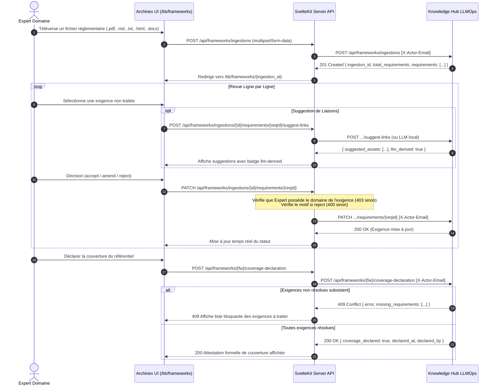

# Conception Technique : Ingestion de Référentiels et Déclaration de Couverture (Lot A10)

## 1. Architecture Globale



## 2. Modèles de Données & Types TypeScript

```typescript
export type FrameworkIngestionFormat = 'pdf' | 'html' | 'txt' | 'md' | 'docx';
export type FrameworkRequirementStatus = 'pending' | 'accepted' | 'amended' | 'rejected';

export interface FrameworkRequirement {
  id: string;
  framework_id: string;
  section: string;
  title: string;
  text: string;
  domain: string;
  status: FrameworkRequirementStatus;
  mapped_assets: string[];
  amendment_notes?: string;
  rejection_reason?: string;
  reviewed_by?: string;
  reviewed_at?: string;
}

export interface FrameworkIngestion {
  id: string;
  framework_id: string;
  framework_name: string;
  version: string;
  file_name: string;
  file_format: FrameworkIngestionFormat;
  file_size_bytes: number;
  created_at: string;
  status: 'processing' | 'ready' | 'failed';
  total_requirements: number;
  reviewed_requirements: number;
  requirements: FrameworkRequirement[];
}

export interface FrameworkLinkSuggestion {
  asset_id: string;
  title: string;
  confidence: number;
  rationale: string;
}

export interface FrameworkLinkSuggestionResult {
  suggested_assets: FrameworkLinkSuggestion[];
  llm_derived: true;
}

export interface CoverageDeclarationResult {
  success: boolean;
  framework_id: string;
  coverage_declared: boolean;
  declared_at: string;
  declared_by: string;
  total_requirements: number;
  covered_requirements: number;
  uncovered_requirements?: string[];
}
```

## 3. Gestion des Erreurs et Robustesse
- **Validation de taille de fichier** : Rejet immédiat avec HTTP 413 si la taille dépasse 20 Mo.
- **Formats autorisés** : Contrôle d'extension et MIME-type (`.pdf`, `.html`, `.txt`, `.md`, `.docx`).
- **Contrôle d'Habilitation 403** : Seuls les experts disposant du domaine spécifié sur l'exigence peuvent la valider ou la rejeter.
- **Conflit 409** : Blocage formel de la déclaration de conformité si des exigences non résolues subsistent.
