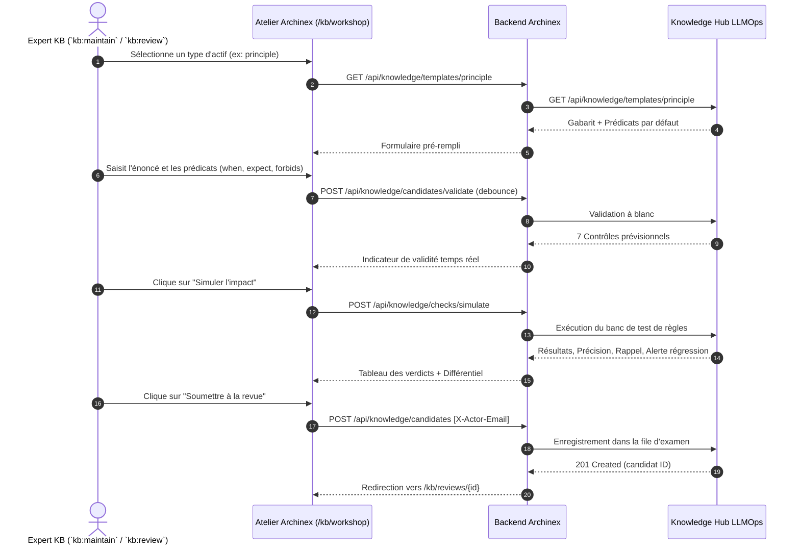

# Conception Technique A8 — Atelier de Doctrine et Simulation de Clauses

## 1. Modèle de Données & Prédicats Testables

### 1.1 Structure d'une Clause Testable
```typescript
export interface TestablePredicates {
  when: string;       // Contexte / condition d'application (ex: "Lorsque le composant manipule des données Secret Défense")
  expect: string;     // Assertion attendue (ex: "Le chiffrement matériel certifié CSPN/FIPS 140-3 doit être activé")
  requires?: string[]; // Prérequis obligatoires (ex: ["HSM souverain dédié", "Audit log immuable"])
  forbids?: string[];  // Éléments strictement proscrits (ex: ["Stockage sur cloud multilocataire standard", "Export de clé en clair"])
}
```

### 1.2 Structure d'un Template d'Actif
```typescript
export type KbAssetType = 'principle' | 'pattern' | 'decision' | 'control' | 'glossary' | 'rule' | 'amendment';

export interface KbAssetTemplate {
  asset_type: KbAssetType;
  title: string;
  description: string;
  default_predicates: TestablePredicates;
  fields: Array<{
    name: string;
    label: string;
    type: 'text' | 'textarea' | 'select' | 'array';
    required: boolean;
    placeholder?: string;
  }>;
  skeleton: string;
}
```

### 1.3 Simulation et Métriques de Précision / Rappel
```typescript
export interface ClauseSimulationRequest {
  asset_type: KbAssetType;
  title: string;
  domain: string;
  predicates: TestablePredicates;
  test_cases?: Array<{
    id: string;
    label: string;
    description: string;
    expected_status: 'supports' | 'violates';
  }>;
}

export interface ClauseSimulationResult {
  simulated_at: string;
  total_cases: number;
  passed_cases: number;
  precision: number;      // Pourcentage 0 à 100
  recall: number;         // Pourcentage 0 à 100
  regression_detected: boolean;
  regression_details?: string;
  verdicts: Array<{
    case_id: string;
    case_label: string;
    status: 'supports' | 'violates' | 'unassessed';
    expected: 'supports' | 'violates';
    matched: boolean;
    rationale: string;
  }>;
}
```

## 2. Flux d'Interaction Séquentiel



## 3. Autorisations et Garde-Fous
- Accès restreint aux utilisateurs ayant au moins un rôle KB actif (`kb:review`, `kb:maintain`, `kb:evaluate`, ou `kb:admin`).
- Rejet si aucun domaine n'est spécifié.
- Alerte bloquante ou non bloquante avant soumission si `regression_detected === true`.
