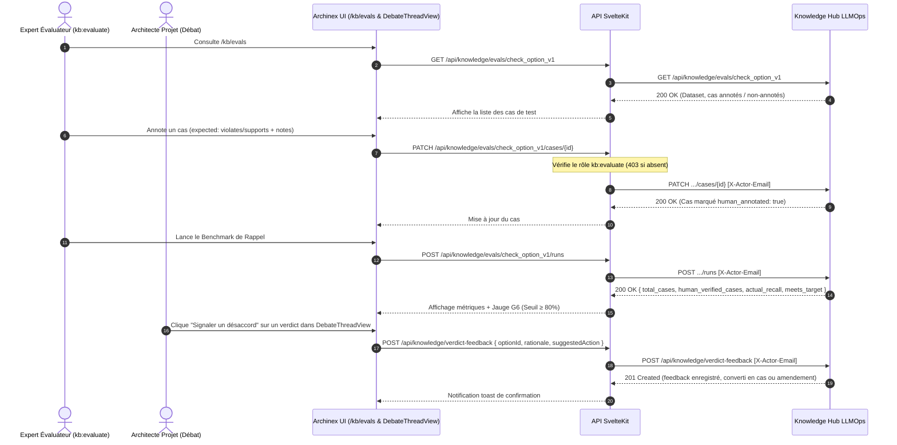

# Conception Technique : Évaluations et Boucle de Retour sur Verdicts (Lot A9 - Porte G6)

## 1. Architecture Globale



## 2. Modèles de Données & Types TypeScript

```typescript
export interface EvalTestCase {
  id: string;
  dataset_id: string;
  option_title: string;
  option_summary: string;
  domain: string;
  rule_id: string;
  expected_status: 'supports' | 'violates';
  human_annotated: boolean;
  annotated_by?: string;
  annotated_at?: string;
  notes?: string;
}

export interface EvalDataset {
  id: string;
  name: string;
  version: string;
  description: string;
  total_cases: number;
  human_annotated_count: number;
  cases: EvalTestCase[];
}

export interface EvalBenchmarkRunResult {
  run_id: string;
  dataset_id: string;
  executed_at: string;
  executed_by: string;
  total_cases: number;
  human_verified_cases: number;
  passed_cases: number;
  precision: number;
  actual_recall: number;
  meets_target: boolean; // actual_recall >= 80%
  verdicts: Array<{
    case_id: string;
    option_title: string;
    rule_id: string;
    predicted_status: 'supports' | 'violates';
    expected_status: 'supports' | 'violates';
    matched: boolean;
    human_annotated: boolean;
  }>;
}

export interface VerdictFeedbackRequest {
  subject_id: string;
  option_id: string;
  rule_id?: string;
  verdict_status?: string;
  disagree_rationale: string;
  suggested_action: 'add_test_case' | 'propose_amendment' | 'clarify_rule';
  author_email?: string;
}

export interface VerdictFeedbackItem {
  id: string;
  subject_id: string;
  option_id: string;
  rule_id?: string;
  verdict_status?: string;
  disagree_rationale: string;
  suggested_action: 'add_test_case' | 'propose_amendment' | 'clarify_rule';
  author_email: string;
  status: 'pending' | 'converted_to_test_case' | 'converted_to_amendment' | 'dismissed';
  created_at: string;
  converted_ref?: string;
}
```

## 3. Contrôles de Sécurité & Règles d'Autorisation
1. **Rôle `kb:evaluate` ou `kb:admin` (403 Forbidden)** : Requis pour modifier les annotations de cas du banc d'évaluation.
2. **Objectif de Rappel de la Porte G6 ($\ge 80\%$)** : Calculé strictement sur la proportion de `human_verified_cases` conformes aux attentes.
3. **Traçabilité du Feedback** : Chaque feedback émis conserve l'e-mail de son auteur, le sujet et l'option débattue.
