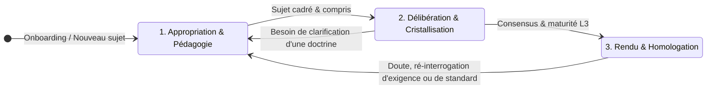

## Why

Dans la conception d'architectures de systèmes complexes (télécoms, défense, banques, infrastructures critiques), les approches actuelles d'assistance par IA souffrent de trois tares fondamentales :
1. **La destruction de la logique par le RAG naïf** : Le découpage textuel aveugle détruit les liens de dérivation (`SUPERSEDES`, compromis d'arbitrage, conditions d'applicabilité).
2. **Le piège du brouillon séduisant** : Les LLMs produisent de la prose fluide et diplomatique. Un document bien écrit se fait valider par politesse ou fatigue : l'expert hoche la tête, mais les quatre décisions critiques non tranchées restent masquées.
3. **Le trou noir de la révisabilité** : Les systèmes savent stocker du contenu ; aucun ne sait ce qui s'effondre lorsqu'un antécédent devient faux six mois plus tard.

**Archinex** renverse ce paradigme :
> *« Le LLM ne rend pas le raisonnement meilleur ; il rend sa trace enfin gratuite à capturer. Le symbolique la rend enfin fiable à réutiliser. »*

Archinex outille **le modèle de la délibération** (comment une équipe d'architectes et d'agents converge sur des décisions auditablement fondées), en laissant le **modèle du système** (composants logiciels, schémas C4, blocs SysML v2) aux outils spécialisés du marché.

---

## Le Partage : Ce qu'on écrit vs Ce qu'on branche

| Domaine | Ce qu'on écrit (Archinex / LLMOps / SmartMemory) | Ce qu'on branche (Outils du marché) |
|---|---|---|
| **Délibération** | `Subject`, `Statement`, `Conflict`, `Question`, gate, arbitrage tracé | *Aucun standard n'existe — c'est notre place* |
| **Induction de règles** | Apprentissage en séance de règles SPARQL candidates approuvées | *Personne ne le fait — notre code* |
| **Maintenance de vérité** | Rétractation en cascade si un antécédent tombe | *Le trou commun — notre code* |
| **Complétude multi-axes** | Sécurité NIS2 × Résilience × Synchronisation × Décisions antérieures | *Outils actuels mono-axe — notre code* |
| **Modèle système logiciel** | *Hors périmètre Archinex* | Structurizr, IcePanel, LikeC4 |
| **Modèle ingénierie système**| *Hors périmètre Archinex* | SysML v2, SysON, Capella |
| **Rendus visuels & schémas** | *Hors périmètre Archinex* | Mermaid, Draw.io, générateurs DOCX |
| **Catalogues de menaces** | *Hors périmètre Archinex* | IriusRisk, SD Elements |

---

## Les Rôles du Système (Aucun nom de personne réelle)

Pour garantir l'indépendance de l'organisation et la pérennité des audits, Archinex opère exclusivement sur des **Rôles formels** :

1. **Lead Architect (Modérateur final)** :
   - Pilote la session de délibération et arbitre en dernier ressort les contradictions (`Conflict` ouvert).
   - Valide le passage des jalons de maturité majeurs (`L2_decomposed` $\rightarrow$ `L3_decided`).
   - Approuve les règles de doctrine candidates (Tour 8).
   - Signe le gel d'homologation des sections de HLD et l'export du snapshot scellé.
2. **Domain Expert Architects (Architectes Spécialisés)** :
   - Experts sectoriels : *Architecte Réseau & Synchronisation*, *Architecte Sécurité & Conformité NIS2*, *Architecte Infrastructure / Cloud*, *Architecte Données*, *Responsable Achats*.
   - Reçoivent les questions ciblées débloquantes (`open_questions`), contestent les brouillons-appâts sur leur spécialité, rectifient les hypothèses et fournissent les preuves locales (`verified`).
3. **Client / Sponsor Métier** :
   - Émetteur des contraintes brutes et besoins exprimés (`stated-by-client`), sollicité sur les arbitrages d'exigences opérationnelles.
4. **Agents IA Spécialisés (Copilotes de délibération)** :
   - *Agent Facilitateur & Pédagogue* : Anime la discussion constructive, vulgarise les contraintes de standards, rappelle proactivement les doctrines et fait émerger de nouvelles idées par confrontation maïeutique.
   - *Agent Élicitation* : Extrait les triplets du fil de discussion multi-acteurs (y compris salon Discord), identifie les manques et les impacts.
   - *Agent Appât & Scénarisation* : Génère le brouillon télégraphique provocateur, chiffre les conséquences (`cost_hint`), formule la variante B divergente.
   - *Agent SmartMemory* : Formalise les règles candidates (SPARQL) et vérifie la cohérence neuro-symbolique.
   - *Agent Portier (LLMOps)* : Gardien symbolique déterministe — refuse toute affirmation non étayée.

---

## Les Trois Postures de Travail Contextuelles & Asynchrones

La progression d'un projet d'architecture dans Archinex n'est **jamais une séquence temporelle globale rigide**. Elle s'articule autour de **trois postures de travail fluides**, activables à la demande par chaque architecte et sur chaque sujet :

1. **Posture 1 : Appropriation & Cadrage Pédagogique** :
   - Ingestion des éléments entrants (RFP, CCTP, HLD V0 préexistant).
   - Rôle pédagogique permanent : vulgarisation à la demande des standards applicables (ex: profils 3GPP MCX, directive NIS2).
   - Acculturation personnalisée : un nouvel expert rejoignant le projet (ex: à la semaine 3) active cette posture pour s'approprier le contexte de ses sujets spécifiques sans ralentir les autres.
   - **Retour permanent** : Un architecte en phase de rédaction peut à tout moment réactiver cette posture pour se faire réexpliquer une exigence ou vérifier la conformité à un standard.
2. **Posture 2 : Délibération & Cristallisation des Idées** :
   - Le cœur de l'élicitation : confrontation constructive des idées et exploration des compromis.
   - Capture continue des échanges entre architectes (via l'interface ou le salon Discord du projet) et avec les agents.
   - Rappel proactif des décisions antérieures (ADRs) et des principes d'architecture pour accélérer le consensus.
   - Suivi sur le Dashboard de la résorption des manques et du franchissement des paliers de maturité.
3. **Posture 3 : Rendu, Schématisation & Homologation** :
   - Synthèse et mise en forme des contenus finaux validés.
   - Génération automatique des schémas d'architecture (C4, Mermaid, Draw.io) projetés fidèlement depuis les énoncés prouvés.
   - Gel granulaire par section et génération du livrable opposable scellé (SHA-256). Deux sections d'un même projet progressent indépendamment vers cette posture.

---

## Capabilities

Le Workbench Archinex se décompose en **7 capacités fonctionnelles fondamentales** :

| ID | Capacité | Description & Valeur Métier | Use Cases Clés |
|---|---|---|---|
| `epistemic-statement` | L'Énoncé à 5 Facettes | Modélise la particule élémentaire de l'architecture : Contenu, Justification, Autorité, Maturité, Révisabilité. Rejette formellement `verified × llm-derived`. | Typage strict d'un fait projet ; vérification de l'enveloppe signée ; traçabilité d'origine. |
| `telegraphic-draft` | Le Brouillon-Appât | Génère en continu un brouillon rugueux, télégraphique, sans phrases complètes. Pose des questions, propose des variantes divergentes et chiffre les coûts. | Provocation de la contestation d'un expert en 10 secondes ; affichage du coût d'une hypothèse (+180 k€). |
| `maturity-board` | Le Board de Maturité & Gaps | Écran d'allocation d'effort classé par **« Débloque » (`unlocks`)**. Visualise en direct le **franchissement des gaps de maturité** et détecte la stagnation (`stall_days`). | Savoir en 5 secondes quel sujet traiter ; observer l'effet d'entraînement d'un arbitrage sur le déblocage du graphe. |
| `diff-sensor` | Le Capteur par le Diff | Édition en place du brouillon. Tout diff engendre un énoncé attribué. **Règle absolue : Le silence n'est pas une approbation.** | Une modification textuelle devient un `Statement` auditable ; une absence de réponse laisse le manque ouvert. |
| `dialectic-dialogue-recall` | Écoute & Maïeutique Constructive | Capture les dialogues entre architectes (y compris salon Discord) et rappelle proactivement les ADRs et principes pour catalyser le consensus. | Débat sur un salon de projet Discord $\rightarrow$ rappel immédiat d'un ADR pertinent $\rightarrow$ émergence et convergence rapide. |
| `retractation-engine` | Rétractation & Vérité | Maintenance de vérité : la chute d'un antécédent ($S_1 \bot$) déclenche la rétrogradation en cascade de ses dérivés vers `assumed`. | Retrait d'une hypothèse de source d'alimentation $\rightarrow$ déclassement instantané de la tenue en holdover. |
| `freeze-export` | Gel de Section & Scellement | Gèle une section dont le sujet est mûr ($\ge L3$). Fixe les `ExternalRef` immuables et produit un snapshot opposable scellé en SHA-256. | Constitution du dossier d'homologation officiel ; projection automatique en schémas et livrables finaux. |

---

## Périmètre & Non-Objectifs (Scope Bounds V1)

### In-Scope (V1)
- Interface SvelteKit / Svelte 5 réactive, local-first avec chargement instantané de snapshots scellés (`sealed_snapshot.json`).
- Pilotage de la progression selon la séquence en 3 phases (Appropriation $\rightarrow$ Délibération $\rightarrow$ Rendu).
- Connexion FastMCP (SSE) au serveur de connaissances et d'engagement LLMOps.
- Passerelle d'écoute et de capture des dialogues (Webhooks Discord / Chat contextuel de séance).
- Moteur de rappel proactif de doctrine (recherche sémantique/Cypher en cours de dialogue).
- Affichage du Board de maturité 6 colonnes avec tri par `unlocks` décroissant et matérialisation du franchissement des gaps.
- Rendu télégraphique du brouillon-appât avec détection et blocage des tournures de complaisance (test de non-régression du ton).
- Panneau d'arbitrage de conflits obligatoire (Tour 11) et d'approbation de règles candidates (Tour 8).

### Out-of-Scope (V1)
- Édition collaborative temps réel concurrente type Google Docs / CRDT multi-curseurs (remplacée en V1 par un verrouillage au niveau section / sujet).
- Moteurs graphiques ou outils de dessin intégrés (Archinex génère la syntaxe Mermaid et les liens d'export vers Structurizr / Draw.io, sans réinventer de canvas propriétaire).
- Ingestion massive automatique de documents bureautiques non structurés dans le navigateur (gérée par le pipeline CLI `ingest_solution_doc.py` côté backend).

