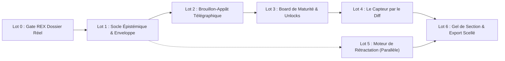

# Tasks : Archinex Deliberation Workbench

Ce carnet de tâches décline la mise en œuvre d'Archinex en s'alignant rigoureusement sur le chemin critique du document cadre (**0 $\rightarrow$ 2 $\rightarrow$ 3 $\rightarrow$ 4 $\rightarrow$ 6**, avec le lot 5 en parallèle).

---

## Chemin Critique & Dépendances

---

## Lot 0 — Gate : Rejouer un Dossier Réel (Conditionne la suite)
*Aucun code UI requis dans ce lot. Établir si le système voit des angles manqués par l'équipe.*

- [ ] **0.1 Sélection du dossier de référence**
  - Choisir un CCTP d'infrastructure/réseau déjà traité dont l'issue et les avenants sont connus.
- [ ] **0.2 Reconstitution de la vérité terrain**
  - Figer la liste horodatée des angles qui avaient manqué à l'époque (critère étalon).
- [ ] **0.3 Passage dans la boucle d'élicitation**
  - Scanner le dossier via `rfp_shredder.py` / `elicit scan` et relever les questions produites.
- [ ] **0.4 Mesure du rappel et de la précision**
  - Compter les angles retrouvés (seuil $\ge 3$) et la proportion de bruit ($< 50\%$).
- [ ] **0.5 Décision formelle de Go / No-Go écrite**
  - Acter le passage au Lot 1 sur preuve mesurée.

---

## Lot 1 — Socle Épistémique & Enveloppe Scellée (UI & Contrats)
*Durée estimée : 1 à 2 semaines*

- [x] **1.1 Modélisation TypeScript de l'énoncé à 5 facettes**
  - Définir `Statement`, `ProductionMode` (`human-authored`, `llm-proposed-human-approved`, `llm-derived`) et `ConfidenceLevel` dans `src/lib/types/epistemic.ts`.
- [x] **1.2 Implémentation du contrat d'enveloppe entrante (`ContributionEnvelope`)**
  - Valider `producer`, `validator`, `production_mode` et `payload_sha256`.
- [x] **1.3 Règle bloquante : Interdiction de `verified × llm-derived`**
  - Ajouter la validation de garde-fou côté client et serveur rejetant formellement cette combinaison.
- [x] **1.4 Tests de contrat unitaires**
  - Écrire les tests Vitest vérifiant le rejet des enveloppes incomplètes ou interdites.

---

## Lot 2 — Le Brouillon-Appât Télégraphique
*Durée estimée : 2 à 3 semaines*

- [x] **2.1 Rendu visuel télégraphique des sections HLD**
  - Créer le composant `TelegraphicDraftView.svelte` affichant les lignes `retenu`, `supposé`, `conflit`, `manque`, `variante B`.
- [x] **2.2 Visualisation du chaînage des conséquences et chiffrage des coûts (`cost_hint`)**
  - Mettre en évidence les surcoûts en k€ (`+180 k€`) et impacts de dimensionnement en rouge/ambre.
- [x] **2.3 Affichage des variantes divergentes (Variante A vs Variante B)**
  - Encadrer les alternatives pour tout sujet en conflit ou sous L3.
- [x] **2.4 Test de non-régression du ton (Anti-Blabla)**
  - Écrire un test de validation rejetant les phrases complètes de plus de 15 mots ou les tournures policées (« il est recommandé »).
- [x] **2.5 Suppression des coches de complaisance**
  - Remplacer les badges « Conforme » par des mentions de couverture vérifiable (« couvert par X », « sous hypothèse Y »).

---

## Lot 3 — Board de Maturité & Allocation d'Effort
*Durée estimée : 2 semaines*

- [x] **3.1 Table de maturité 6 colonnes avec tri par Déblocages (`unlocks_count`)**
  - Implémenter `MaturityBoardTable.svelte` avec tri prioritaire sur la colonne `Débloque`.
- [x] **3.2 Pastille et indicateur visuel de stagnation (`stall_days`)**
  - Afficher l'alerte de stagnation pour tout sujet non promu depuis plus de 14 jours.
- [x] **3.3 File des questions sortantes et relance en 1 clic**
  - Regrouper les questions ouvertes par rôle destinataire avec bouton de notification directe.
- [x] **3.4 Couplage dynamique Board $\leftrightarrow$ Brouillon**
  - Synchroniser l'affichage du panneau brouillon sur sélection d'une ligne du Board.
- [x] **3.5 Alimentation bi-mode (SSE FastMCP / Snapshot local)**
  - Connecter le store à l'API LLMOps avec bascule transparente sur `fixtures/sealed_snapshot.json`.
- [x] **3.6 Sélecteur de posture contextuelle (Non-bloquant)**
  - Implémenter `ContextualPostureSelector.svelte` permettant à l'architecte de basculer à tout moment entre Appropriation/Pédagogie, Délibération et Rendu sur le sujet actif.
- [x] **3.7 Matérialisation visuelle du franchissement des gaps de maturité**
  - Développer `GapProgressionWidget.svelte` pour afficher en direct le comblement des gaps (G1 à G5) et l'effet domino de déblocage.

---

## Lot 4 — Le Capteur par le Diff, Écoute Multi-Canale & SmartMemory
*Durée estimée : 2 à 3 semaines*

- [x] **4.1 Édition en place du brouillon télégraphique**
  - Créer l'éditeur inline réactif `TelegraphicDraftEditor.svelte`.
- [x] **4.2 Moteur de détection de diff et création d'énoncé attribué**
  - Analyser les modifications textuelles et générer un `Statement` `human-authored` avec ses antécédents.
- [x] **4.3 Implémentation stricte de la règle du silence**
  - Garantir qu'aucune modification ni promotion de maturité n'intervient en l'absence de saisie active.
- [x] **4.4 Intégration de SmartMemory (lib cliente)**
  - Brancher l'extracteur NLP et le générateur de règles SPARQL candidates (Tour 8).
- [x] **4.5 Interface d'approbation de règles candidates (Tour 8)**
  - Créer `RuleApprovalBanner.svelte` réservé à la validation par le Lead Architect.
- [x] **4.6 Panneau de délibération multi-acteurs & connecteur Discord**
  - Développer `DialecticChatPanel.svelte` avec capture des échanges de salon de projet Discord et du chat intégré.
- [x] **4.7 Moteur de rappel proactif de doctrine (ADRs & Principes)**
  - Intégrer les cartes `DoctrineRecallCard.svelte` surgissant en séance lors de l'évocation d'un sujet déjà tranché.
- [ ] **4.8 Cadrage pédagogique lors de l'ingestion initiale d'un RFP (Phase 1)**
  - Générer les synthèses explicatives des standards (3GPP, NIS2) pour aligner l'équipe avant délibération.
- [x] **4.9 Inspecteur de justification (« Pourquoi ? ») et simulateur d'impact**
  - Développer `WhyInspector.svelte` et simulateur connectés au graphe d'énoncés pour évaluer les dépendances en 1 clic.

---

## Lot 5 — Moteur de Rétractation (En Parallèle)
*Durée estimée : 4 à 6 semaines*

- [x] **5.1 Graphe des antécédents et dépendances transitives**
  - Modéliser la relation `based_on` et le graphe acyclique direct (DAG) des dérivations.
- [x] **5.2 Algorithme d'invalidation de clôture logique**
  - Déclencher la rétrogradation en cascade vers `assumed` lors de la suppression ou contestation d'un antécédent.
- [x] **5.3 Rétrogradation automatique de maturité du sujet**
  - Rétrograder le sujet associé et réactiver le statut `provisoire` (`is_provisional: true`).
- [x] **5.4 Tests unitaires de rétractation**
  - Vérifier que la contestation de `S-0031` fait retomber `S-0042` à `assumed` et met à jour le Board.

---

## Lot 6 — Gel de Section & Export Scellé
*Durée estimée : 1 semaine*

- [x] **6.1 Dialogue de gel granulaire par section**
  - Implémenter la barrière de certification (interdiction de geler si conflits ouverts ou sujet sous L3).
- [x] **6.2 Conversion en références externes immuables (`ExternalRef`)**
  - Figer les citations sous le format `KH:AssetId@vVersion` ou `@sha256:...`.
- [x] **6.3 Scellement cryptographique SHA-256 du snapshot exporté**
  - Générer le paquet de livraison officiel opposable pour l'homologation.
- [x] **6.4 Export vers formats de rendu système (Mermaid, Structurizr, SysML v2, PTP JSON)**
  - Valider la projection sans perte vers les outils de modélisation système du marché.
- [x] **6.5 Hub de régénération d'artefacts déterministe (No Doc Drift)**
  - Développer `ArtifactRegenerationHub.svelte` projetant les énoncés prouvés en Structurizr DSL, SysML v2 et profils de configuration (PTP JSON / Terraform).
